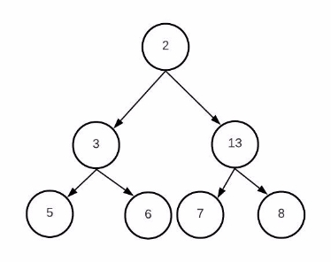

Data Structures

Homework 1

**Mostafa S. Ibrahim !**

*Teaching, Training and Coaching since more than a decade!* 

*Artificial Intelligence & Computer Vision Researcher* 

*PhD* from Simon Fraser University - Canada *Bachelor / Msc* from Cairo University - Egypt Ex-(Software Engineer / ICPC World Finalist) 

Problem #1: Tree Max

- int tree\_max() 

- Inside BinaryTree class, add this member function. It  returns the maximum value in the whole tree 
- The function should follows the recursive style 
- E.g. similar to preorder traversal 
- In the this tree, the max value is 13 
- Create several trees using the add functions we  learned and test your code 

Problem #2: Tree Height

- int tree\_height() 

- It returns the height of the whole tree 
- In the this tree, the answer is 2 coming from right  branch 

Problem #3: Count all nodes

- int total\_nodes() 

- It returns the total number of nodes in the tree 
- In the this tree, the answer is 5 

Problem #4: Count leaf nodes

- int total\_nodes() 

- It returns the number of leaf nodes in the tree 
- In the this tree, the answer is 3 

Problem #5: Search the tree

- bool is\_exists(int value) 

- It returns true if this value exists 
- E.g. is\_exists(13) ⇒ true 
- E.g. is\_exists(70) ⇒ false 

Problem #6: Is Perfect Tree

- bool is\_perfect() 

- It returns tree if the tree is perfect 
- Develop it in 2 ways 
- Recursive way 
- Formula based-way 

**“Acquire knowledge and impart it to the people.” “Seek knowledge from the Cradle to the Grave.”**
