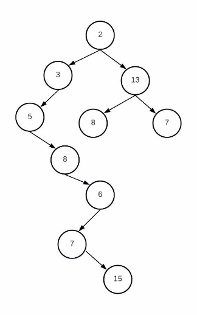

Data Structures

Homework 2

**Mostafa S. Ibrahim**

*Teaching, Training and Coaching since more than a decade!* 

*Artificial Intelligence & Computer Vision Researcher* 

*PhD* from Simon Fraser University - Canada *Bachelor / Msc* from Cairo University - Egypt Ex-(Software Engineer / ICPC World Finalist) 

Problem #1: Binary Tree Destructor

- Develop void clear() that clear the whole tree
- Develop ~BinaryTree() that clear the whole tree

Problem #2: Inorder iterative

- void print\_inorder\_iterative()
- Develop this function that prints the tree inorder
- This time you won’t use the recursion
- Replace recursion with a stack

Problem #3: Tree boundary 

- void traverse\_left\_boundry() 
- Prints theses on the boundary 
- Nodes of tree left boundary are nodes  from the nodes to the **left-most** node  in a tree 
- Node 15 here is **most-left** node 
- Most-left doesn’t mean you just keep going  left tell no more left 
- Do u see why we call it boundary? 
- **Output is: 2 3 5 8 6 7 15** 

Problem #4: Binary Tree [Diameter](https://leetcode.com/problems/diameter-of-binary-tree) 

- The diameter of a binary tree is the length of the  **longest path** between any two nodes in a tree.  
- The longest path here is from node 8 to node 15 
- 8 13 2 3 5 8 6 7 15 
- Tips 
- The code follows similar recurrence to tree height  function 
- This path may or may not pass through the root. 
- Develop logic for each of these 2 cases 

Problem #5: Expression Tree

- Add a **new constructor**: BinaryTree(string postfix) 

- It builds an expression tree based on the given postfix expression
- E.g. BinaryTree root("23+4\*");
- When you call the print\_postorder, the **output must be same** to the input
- Tip: Similar logic to postfix evaluation code

Problem #6: Expression Tree Inorder

- When we try to print the tree inorder for this  

expression tree, the output is: 2+3\*4 
- But this is wrong as it should be (2+3)\*4 
- Implement **print\_inorder\_expression**() 
- This function add proper parentheses to have valid infix output
- 51+2/ ⇒ (5+1)/2 
- 534\*2^+ ⇒ 5+((3\*4)^2) 

**“Acquire knowledge and impart it to the people.” “Seek knowledge from the Cradle to the Grave.”**
