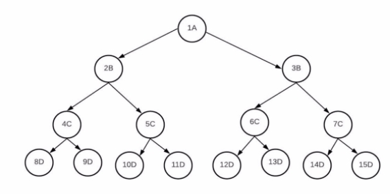

Data Structures

Homework 3

**Mostafa S. Ibrahim !**

*Teaching, Training and Coaching since more than a decade!* 

*Artificial Intelligence & Computer Vision Researcher* 

*PhD* from Simon Fraser University - Canada *Bachelor / Msc* from Cairo University - Egypt Ex-(Software Engineer / ICPC World Finalist) 

Problem #1:  Recursive Level Order Traversal

- void level\_order\_traversal\_recursive()
- How can we still get the answer based on a recursive way instead of the queue?
- Tip it is slower.
- Compute time complexity 

Problem #2: Level Order Spiral 

- void level\_order\_traversal\_spiral()
- In this one, we print the tree in a spiral way
- Output 

- Level 0: A1 
- Level 1: B3 B2 
- Level 2: C4 C5 C6 C7 
- Level 3: D15 D14 D13 D12 D11 D10 D9 D8 ○
- Observe
- **Even** levels are **reversed**

Problem #3: Is [complete](media/https://leetcode.com/problems/check-completeness-of-a-binary-tree) Binary Tree

- bool is\_complete()
- The function returns tree if the tree is a complete one
- Make sure to test the different cases

**“Acquire knowledge and impart it to the people.” “Seek knowledge from the Cradle to the Grave.”**
